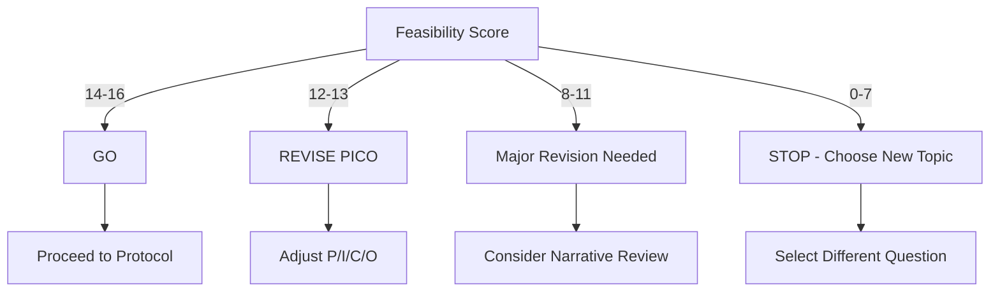

# Mandatory Feasibility Assessment Checklist

**Purpose**: Prevent wasted effort on unanswerable research questions
**Time Required**: 4 hours
**When**: BEFORE any data extraction or tool development
**Decision**: GO / REVISE / STOP

---

## ❗ Why This Matters

**Lesson learned**: A pilot project spent 13 hours before discovering:

- Only 2/10 studies had usable data
- Studies were too heterogeneous to pool
- Research question didn't match available literature

**Cost**: 9+ hours wasted that could have been avoided with upfront assessment

> See `docs/archive/cdk46-project/PROJECT_LESSONS_LEARNED.md` for detailed case study

---

## 📋 4-Hour Feasibility Assessment

### Hour 1: Literature Landscape Scan

#### Task: Quick search and abstract review

```bash
# PubMed search with broad terms
# Generic example:
([intervention keywords] OR [drug names]) AND
([condition keywords] OR [outcome terms]) AND
([population terms]) AND
(randomized OR trial OR cohort)
```

**What to check**:

- [ ] Number of results: ≥50 (good), 20-50 (marginal), <20 (warning)
- [ ] Study types: Mostly RCTs/cohorts? Or reviews/case reports?
- [ ] Publication dates: Recent (last 5 years)? Or outdated field?
- [ ] Language: Mostly English? Or need translation?

**Review 15 abstracts and note**:

- Study designs (RCT, cohort, case series?)
- Sample sizes (powered studies? Or small case series?)
- Interventions compared (consistent? Or all different?)
- Outcomes reported (HR/RR? Or just descriptive?)

**Red flags** 🚩:

- ❌ Mostly review articles (no original data)
- ❌ Mostly case reports/series (can't pool)
- ❌ All single-arm studies (no comparators)
- ❌ Different interventions in each study (can't compare)

---

### Hour 2: Pilot Data Extraction (3 studies)

#### Task: Download and extract from 3 representative PDFs

**Selection criteria**:

1. Most recent study (represents current standards)
2. Largest sample size (likely well-powered)
3. Different intervention if available (assess heterogeneity)

**What to extract manually**:

| Field                 | Study 1           | Study 2 | Study 3 |
| --------------------- | ----------------- | ------- | ------- |
| Study design          |                   |         |         |
| Sample size (n)       |                   |         |         |
| Intervention          |                   |         |         |
| Comparator            |                   |         |         |
| Primary outcome       |                   |         |         |
| **HR/RR reported?**   | Yes/No            | Yes/No  | Yes/No  |
| **95% CI reported?**  | Yes/No            | Yes/No  | Yes/No  |
| **p-value reported?** | Yes/No            | Yes/No  | Yes/No  |
| Data location         | Text/Table/Figure |         |         |

**Critical questions**:

1. **Outcome reporting**: Do all 3 report quantitative effect sizes (HR/RR/OR)?
   - ✅ Yes, all 3 → Good
   - ⚠️ 2 out of 3 → Marginal
   - ❌ 0-1 out of 3 → **STOP**

2. **Clinical homogeneity**: Are interventions comparable?
   - ✅ Same drug class, similar settings → Good
   - ⚠️ Related but different → Needs subgroup analysis
   - ❌ Completely different → **Cannot pool**

3. **Data accessibility**: Can you extract key data in 20 min per study?
   - ✅ Yes, clear tables/text → Good
   - ⚠️ Difficult, buried in text → Slow but doable
   - ❌ Data not reported → **STOP**

---

### Hour 3: Feasibility Scoring

#### Task: Systematic assessment using scoring rubric

```
Score each criterion: 2 (Good), 1 (Marginal), 0 (Poor)
Minimum score to proceed: 12/16 (75%)
```

| Criterion                                          | Score (0-2) | Evidence | Notes |
| -------------------------------------------------- | ----------- | -------- | ----- |
| **1. Study quantity**                              |             |          |       |
| ≥15 studies (2), 10-14 (1), <10 (0)                |             |          |       |
| **2. Study quality**                               |             |          |       |
| Mostly RCTs (2), Mixed (1), Mostly obs (0)         |             |          |       |
| **3. Outcome reporting**                           |             |          |       |
| All report HR/RR (2), >50% (1), <50% (0)           |             |          |       |
| **4. Clinical homogeneity**                        |             |          |       |
| Same comparison (2), Similar (1), Different (0)    |             |          |       |
| **5. Population similarity**                       |             |          |       |
| Same disease/stage (2), Related (1), Different (0) |             |          |       |
| **6. Data extractability**                         |             |          |       |
| Easy to extract (2), Moderate (1), Difficult (0)   |             |          |       |
| **7. Recent literature**                           |             |          |       |
| >50% in last 3 yrs (2), 3-5 yrs (1), Older (0)     |             |          |       |
| **8. Precedent**                                   |             |          |       |
| Similar MA exists (2), Related (1), None (0)       |             |          |       |
| **TOTAL SCORE**                                    | **/16**     |          |       |

**Interpretation**:

- **14-16 points**: ✅ **GO** - Excellent feasibility
- **12-13 points**: ⚠️ **REVISE** - Feasible but needs PICO adjustment
- **8-11 points**: 🚨 **RECONSIDER** - Major challenges expected
- **0-7 points**: ❌ **STOP** - Not feasible, choose different question

---

### Hour 4: Decision and Documentation

#### Task: Make GO/REVISE/STOP decision and document

**Decision framework**:



**If GO** ✅:

- Document: "Feasibility assessment passed (score: X/16)"
- Document key assumptions and limitations
- Proceed to full protocol development
- Expected completion: High confidence

**If REVISE** ⚠️:

- Identify: Which PICO element needs adjustment?
  - Population too narrow? (expand inclusion criteria)
  - Intervention too specific? (broaden drug class)
  - Comparator not standard? (change comparison)
  - Outcome not reported? (switch to different outcome)
- Re-run: 2-hour mini-assessment with revised PICO
- Decision: GO if score improves to ≥14, STOP if not

**If STOP** ❌:

- Document: "Feasibility assessment failed (score: X/16)"
- Document specific reasons (outcome reporting? heterogeneity?)
- Archive work: Save search strategy and notes
- Move on: Select different research question
- **Total time invested**: 4 hours (not 13+ hours!)

---

## 📝 Feasibility Report Template

```markdown
# Feasibility Assessment Report

**Research Question**: [PICO statement]
**Assessment Date**: [Date]
**Time Invested**: 4 hours
**Decision**: GO / REVISE / STOP

---

## Literature Landscape

- **Search results**: [N] studies identified
- **Study designs**: [RCT %], [Cohort %], [Other %]
- **Date range**: [Oldest] to [Newest]
- **Geographic distribution**: [Countries/regions]

## Pilot Extraction Results

| Criterion            | Result               | Assessment   |
| -------------------- | -------------------- | ------------ |
| HR/RR reported       | X/3 studies          | ✅ / ⚠️ / ❌ |
| Clinical homogeneity | [Description]        | ✅ / ⚠️ / ❌ |
| Data extractability  | [Avg time per study] | ✅ / ⚠️ / ❌ |

## Feasibility Score

**Total**: [X]/16 points

- Study quantity: [X]/2
- Study quality: [X]/2
- Outcome reporting: [X]/2
- Clinical homogeneity: [X]/2
- Population similarity: [X]/2
- Data extractability: [X]/2
- Literature recency: [X]/2
- Precedent: [X]/2

## Decision Rationale

[2-3 sentences explaining the decision]

**If GO**:

- Expected number of includable studies: [N]
- Expected effect measure: [HR/RR/OR]
- Anticipated challenges: [List]
- Mitigation strategies: [List]

**If REVISE**:

- Problem identified: [Specific issue]
- Proposed PICO revision: [New PICO]
- Re-assessment planned: [Date]

**If STOP**:

- Fatal flaw: [Main reason]
- Alternative topics to consider: [List]
- Knowledge gained: [What we learned]
```

---

## 🎯 Success Criteria for Different Meta-Analysis Types

### Standard Pairwise Meta-Analysis

**Minimum requirements**:

- ✅ ≥5 studies with comparable interventions
- ✅ ≥80% report same outcome measure (HR/RR/OR)
- ✅ Similar populations (same disease/stage)
- ✅ Extractable quantitative data

**Red flags**:

- ❌ <3 studies (too few for meaningful pooling)
- ❌ All different comparators (no common comparison)
- ❌ Mostly single-arm studies (no effect sizes)

### Network Meta-Analysis

**Minimum requirements**:

- ✅ ≥10 studies forming connected network
- ✅ ≥3 different interventions compared
- ✅ Transitivity assumption plausible
- ✅ Sufficient data for each comparison

**Red flags**:

- ❌ Disconnected network (isolated comparisons)
- ❌ High heterogeneity across comparisons
- ❌ Insufficient studies per comparison node

### Individual Patient Data (IPD) Meta-Analysis

**Minimum requirements**:

- ✅ Contact information for study authors available
- ✅ Studies published within last 10 years
- ✅ IPD sharing feasible (willing authors, no restrictions)

**Red flags**:

- ❌ Authors unresponsive or data unavailable
- ❌ Proprietary/commercial trials (unlikely to share)
- ❌ Inconsistent data formats across studies

---

## 🚨 Common Feasibility Red Flags

### Fatal Flaws (STOP immediately)

1. **No quantitative outcomes reported**
   - Studies only report descriptive statistics
   - No effect sizes (HR/RR/OR/MD)
   - Cannot calculate from available data

2. **Extreme heterogeneity**
   - Every study compares different interventions
   - Different populations (e.g., adult vs pediatric)
   - Different outcome definitions (no common measure)

3. **Insufficient studies**
   - <3 studies identified
   - Most are review articles or protocols
   - No original data available

4. **Inaccessible data**
   - Results only in conference abstracts
   - Full-text not available (no institutional access)
   - Data behind paywalls with no access

### Warning Signs (REVISE needed)

1. **Limited outcome reporting**
   - Only 50-70% studies report desired outcome
   - Need to contact authors for missing data
   - May need to use surrogate outcomes

2. **Moderate heterogeneity**
   - Related but not identical interventions
   - Slightly different populations
   - Can address with subgroup analysis

3. **Mixed study designs**
   - Combination of RCTs and observational studies
   - Different follow-up durations
   - Needs sensitivity analysis

---

## 📊 Case Study: Real-World Post-Mortem

> **Full case study**: `docs/archive/cdk46-project/PROJECT_LESSONS_LEARNED.md`

**Summary**: A pilot project demonstrated why this checklist matters:

| Phase                  | Actual Time | With Checklist |
| ---------------------- | ----------- | -------------- |
| Protocol + Search      | 4 hours     | 4 hours        |
| Screening + Extraction | 9 hours     | **0 hours**    |
| Total                  | 13 hours    | 4 hours        |

**Key findings from post-mortem**:

- Feasibility score: **3/16** (clear STOP signal)
- Fatal flaws: Insufficient studies, <50% report HR, heterogeneous comparisons
- **Lesson**: 4-hour assessment would have saved 9+ hours

**Apply this checklist to avoid the same fate.**

---

## ✅ Integration with Systematic Review Workflow

### NEW Mandatory Workflow

```
Week 1:
Day 1: Draft PICO
Day 2-3: Feasibility assessment (4 hours) ← NEW MANDATORY STEP
Day 3: GO/REVISE/STOP decision

If GO:
Week 2: Full protocol development
Week 3-4: Literature search and screening
Week 5-6: Data extraction
Week 7-8: Meta-analysis and manuscript

If REVISE:
Day 4-5: Revise PICO and re-assess
Day 5: GO/STOP decision
[Continue as above if GO]

If STOP:
Day 4: Select new research question
[Restart with new PICO]
```

### Integration Points

1. **After PICO development**: Run feasibility before protocol
2. **Before tool setup**: Validate feasibility before automation
3. **Before data extraction**: Confirm studies exist and have data
4. **Checkpoint**: Re-assess if major deviations found during screening

---

## 🎓 Summary: The 4-Hour Investment That Saves Weeks

**Investment**: 4 hours upfront
**Potential savings**: 10-40 hours of wasted work
**ROI**: 250-1000%

**What you get**:

- ✅ Confidence the question is answerable
- ✅ Realistic timeline and expectations
- ✅ Early identification of challenges
- ✅ Ability to pivot before significant investment

**What you avoid**:

- ❌ Weeks of work on unanswerable questions
- ❌ Discovering problems after data extraction
- ❌ Incomplete projects with no publication
- ❌ Wasted time and resources

---

## 📚 Additional Resources

**For different study types**:

- Cochrane Handbook: "Assessing feasibility" (Chapter 2)
- PRISMA-P: Protocol requirements for feasibility
- JBI Manual: Feasibility assessment for different review types

**Tools**:

- PubMed Clinical Queries (pre-filtered searches)
- Rayyan (quick abstract screening)
- Research Rabbit (literature mapping)

---

**Created**: 2026-02-06
**Based on**: Lessons from pilot meta-analysis projects
**Status**: Mandatory for all future systematic reviews
**Case studies**: `docs/archive/cdk46-project/`

---

## 🎯 Quick Reference: 4-Hour Feasibility Checklist

- [ ] Hour 1: Literature scan (15 abstracts reviewed)
- [ ] Hour 2: Pilot extraction (3 PDFs, key data extracted)
- [ ] Hour 3: Feasibility scoring (scored 8 criteria)
- [ ] Hour 4: Decision documented (GO/REVISE/STOP)

**Minimum score to proceed**: 12/16 (75%)

**Remember**: 4 hours now saves weeks later!
