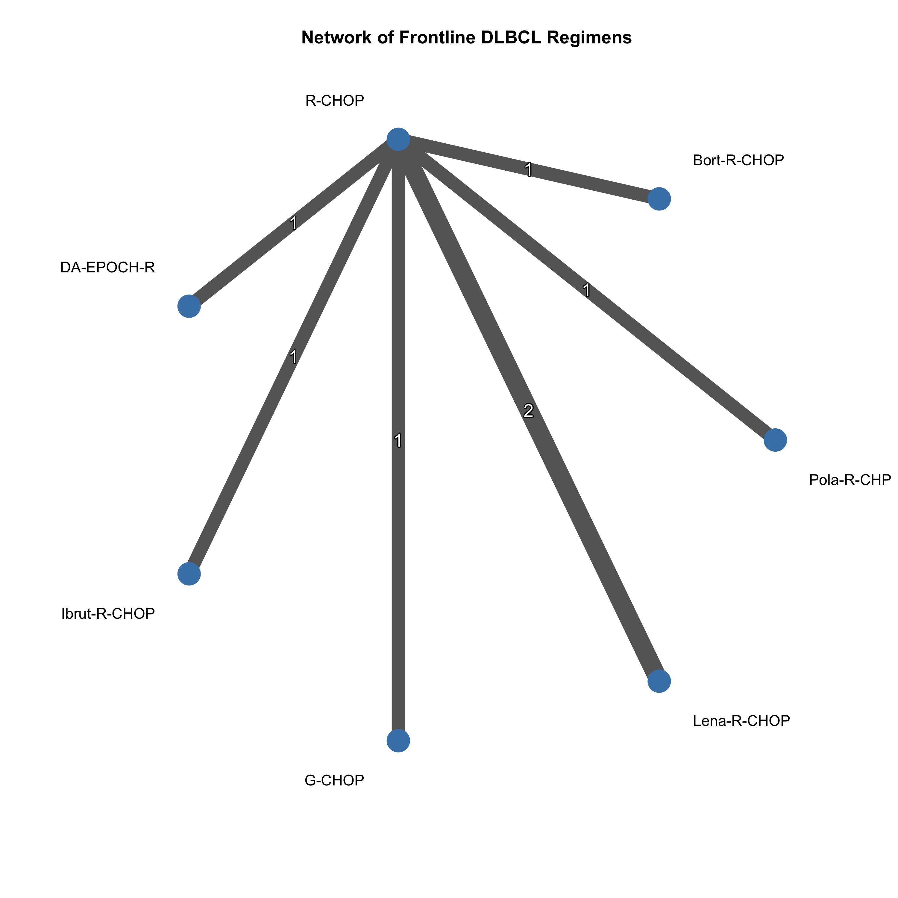
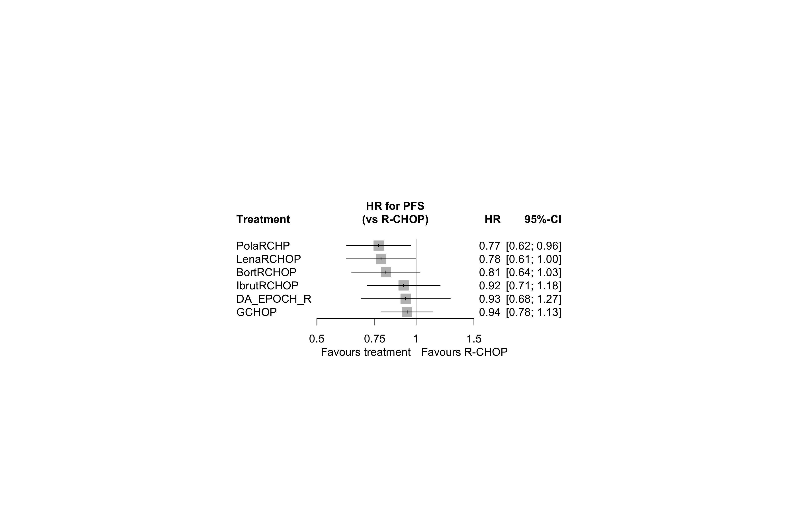
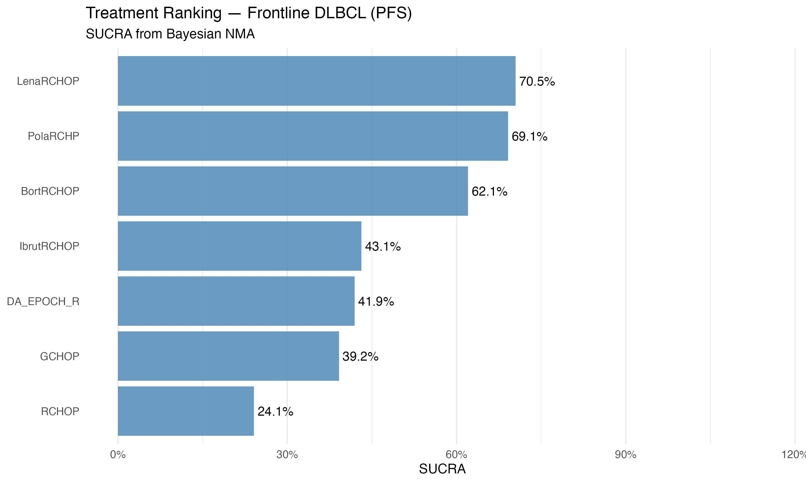
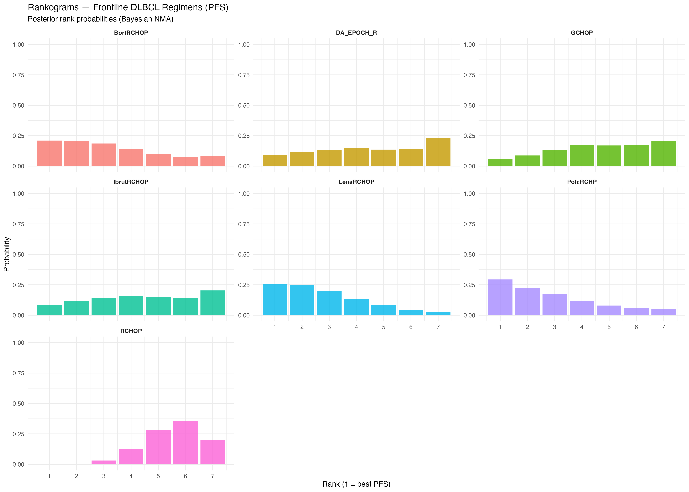
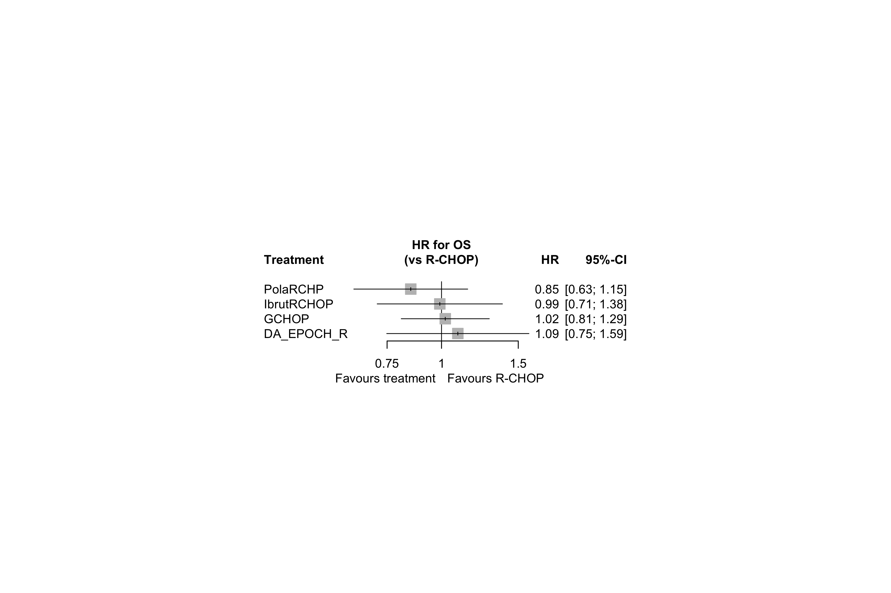
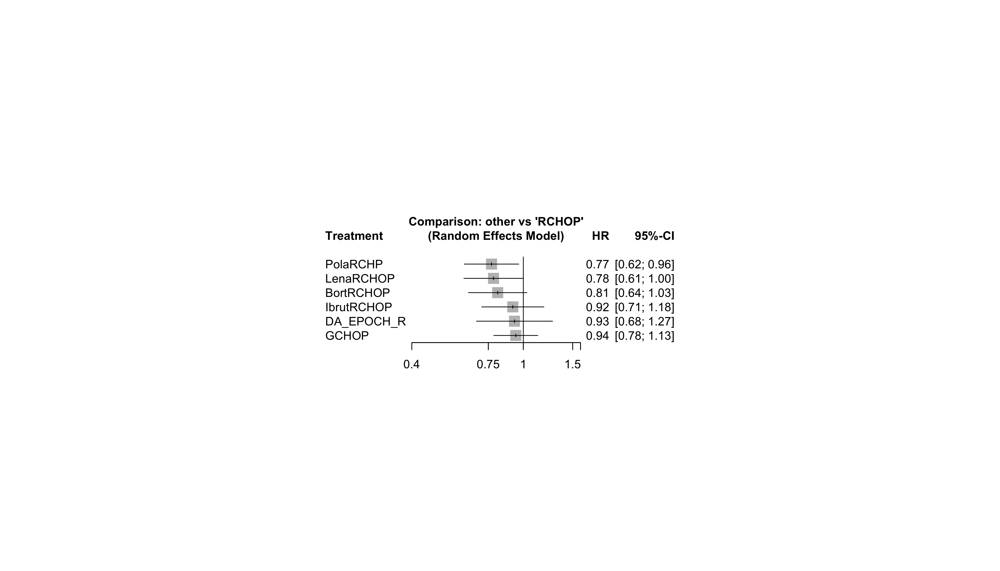
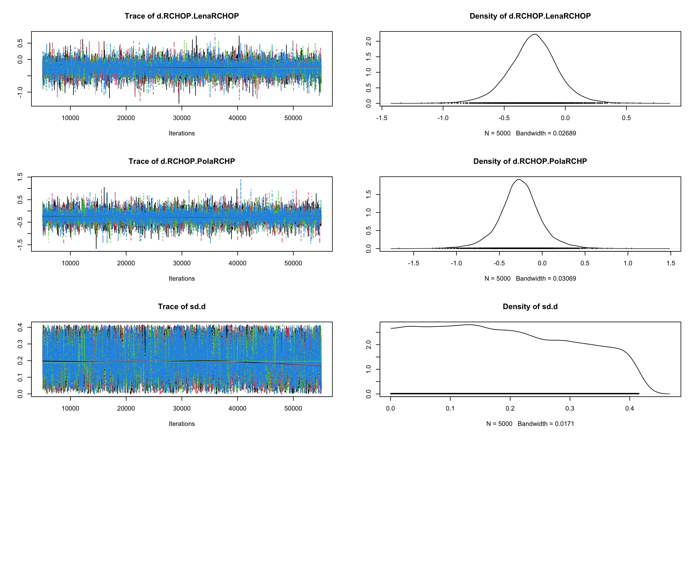
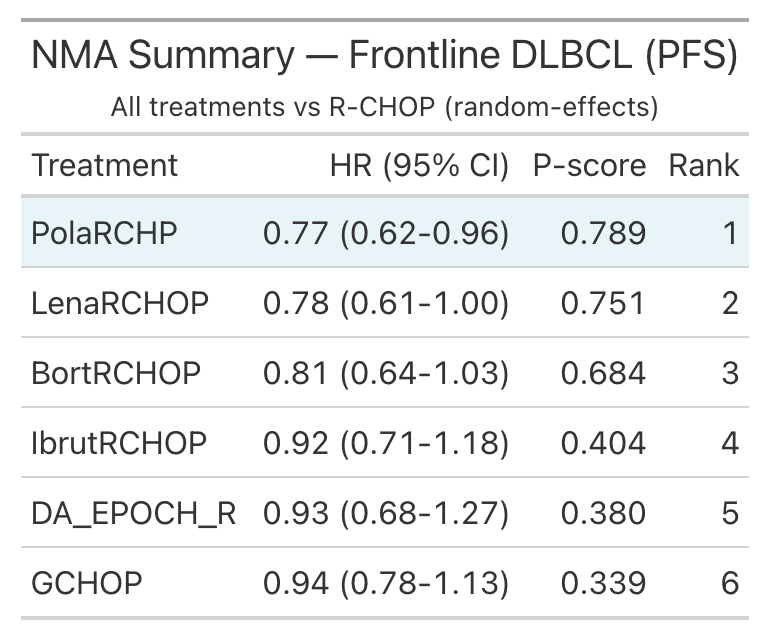
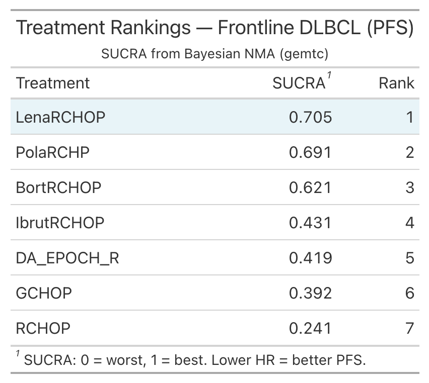

# Figure Legends

## Main Figures

### Figure 1. Network geometry of frontline DLBCL chemoimmunotherapy regimens.

Star-shaped network with R-CHOP as the common comparator. Node size reflects the number of studies contributing to each treatment. Edge thickness indicates the number of studies per comparison. Lena+R-CHOP has two contributing studies (ROBUST and ECOG-E1412); all other comparisons are informed by a single trial. Seven phase III RCTs, 5,463 patients.

---

### Figure 2. Forest plot of network meta-analysis for progression-free survival.

Hazard ratios (95% CI) for PFS of each treatment versus R-CHOP from the frequentist random-effects NMA. Treatments are ordered by effect size. Pola-R-CHP is the only treatment with a statistically significant HR (0.77, 95% CI 0.62–0.96). Heterogeneity: I² = 0%, tau² < 0.0001.

---

### Figure 3. Treatment ranking by SUCRA — progression-free survival.

Surface under the cumulative ranking curve (SUCRA) values derived from Bayesian NMA posterior distributions. Higher SUCRA indicates greater probability of being the best treatment. Lena+R-CHOP (70.5%) and Pola-R-CHP (69.1%) are closely ranked; R-CHOP ranks last (24.1%). SUCRA values should be interpreted alongside the precision of effect estimates (Figure 2).

---

### Figure 4. Rankograms — posterior rank probability distributions.

Rankograms showing the probability of each treatment occupying each rank position (1 = best PFS, 7 = worst PFS) from Bayesian posterior distributions. The wide distributions for most treatments reflect the overlapping confidence intervals in this star-shaped network. Pola-R-CHP and Lena+R-CHOP have the highest probabilities of ranking 1st or 2nd.

---

### Figure 5. Forest plot of network meta-analysis for overall survival.

Hazard ratios (95% CI) for OS of treatments versus R-CHOP from frequentist NMA (4 trials with OS data). No treatment achieved statistically significant OS improvement. Note: ROBUST, ECOG-E1412, and REMoDL-B did not report OS HR with 95% CI and are excluded.

---

## Supplementary Figures

### Supplementary Figure S1. Fixed-effect vs random-effects model comparison.

Comparison of fixed-effect (common) and random-effects NMA estimates for PFS. Results are nearly identical, consistent with the negligible heterogeneity (I² = 0%).

---

### Supplementary Figure S2. MCMC trace plots for Bayesian NMA convergence.

Trace plots for all treatment effect parameters and between-study heterogeneity (sd.d) from the Bayesian random-effects consistency model. Four chains, 50,000 iterations each (5,000 adaptation, thinning = 10). All chains show excellent mixing and convergence (Gelman-Rubin Rhat ≤ 1.001 for all parameters).

---

## Tables (as figures)

### Table 2. NMA summary — all treatments vs R-CHOP.

### Table 3. Treatment rankings (SUCRA).

