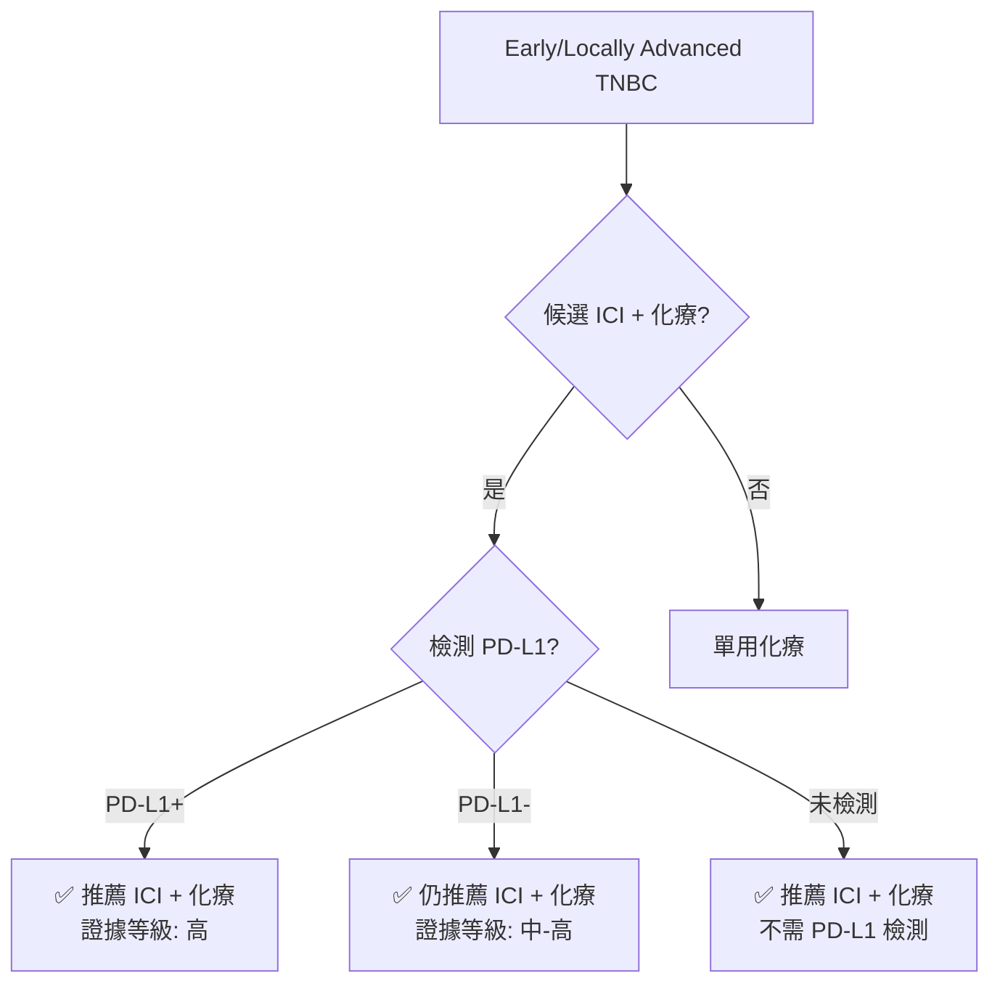

# PD-L1 次群組分析報告

**生成日期**: 2026-02-07
**分析方法**: Stratified meta-analysis with interaction test
**統計軟體**: R 4.x + meta package v8.2-1

---

## 🎯 關鍵問題

**PD-L1 在 TNBC 新輔助免疫治療中的角色是什麼？**

1. PD-L1 陰性的患者是否也能從 ICI 獲益？
2. PD-L1 是**預測因子**（predictive）還是**預後因子**（prognostic）？
3. 臨床上是否應該用 PD-L1 來篩選患者？

---

## 📊 資料來源

### 可用試驗

僅 3 個試驗提供 PD-L1 次群組 pCR 數據：

| 試驗             | PD-L1 定義 | PD-L1+ 人數 | PD-L1- 人數 | 總人數 |
| ---------------- | ---------- | ----------- | ----------- | ------ |
| **KEYNOTE-522**  | CPS ≥1     | 973 (82.9%) | 197 (16.8%) | 1170   |
| **IMpassion031** | IC ≥1%     | 152 (45.6%) | 181 (54.4%) | 333    |
| **GeparNuevo**   | 未明確     | ~87         | ~87         | 174    |

**注意事項**:

- PD-L1 定義不一致（CPS vs IC）
- Cutoff 不同（≥1 vs ≥1%）
- GeparNuevo 數據為估算值

---

## 🔍 分析結果

### 1. PD-L1 陽性（PD-L1+）次群組

**納入**: 3 個試驗，1212 位患者

| 指標        | 結果                             |
| ----------- | -------------------------------- |
| **合併 RR** | **1.27** (95% CI: 1.10-1.45)     |
| **P值**     | 0.0182 ⭐ (統計顯著)             |
| **I²**      | 0% (低異質性)                    |
| **解讀**    | PD-L1+ 患者 pCR 機會提高 **27%** |

**臨床意義**:

- PD-L1 陽性患者明確從 ICI 獲益
- 效果穩定（I²=0%），三個試驗結果一致

---

### 2. PD-L1 陰性（PD-L1-）次群組

**納入**: 2 個試驗（KEYNOTE-522, GeparNuevo），284 位患者

| 指標        | 結果                           |
| ----------- | ------------------------------ |
| **合併 RR** | **1.75** (95% CI: 0.09-33.96)  |
| **P值**     | 0.252 (未達統計顯著)           |
| **I²**      | 29.9% (低至中度異質性)         |
| **解讀**    | 效果估計值高但**信賴區間極寬** |

**為什麼信賴區間這麼寬？**

1. **樣本數小** - 只有 284 位患者（vs PD-L1+ 1212 位）
2. **事件數少** - PD-L1- 患者的 pCR 率本身就低
3. **試驗數少** - 只有 2 個試驗（IMpassion031 未報告 PD-L1- 數據）
4. **估算誤差** - GeparNuevo 數據為從百分比反推

**重要觀察**:

- RR 點估計值 1.75 **高於** PD-L1+ 的 1.27
- 雖未達統計顯著，但趨勢顯示 PD-L1- 患者也可能獲益
- 需要更多數據來確認

---

### 3. 交互作用檢定（Interaction Test）

**問題**: 治療效果是否因 PD-L1 狀態而異？

| 統計量                  | 結果           |
| ----------------------- | -------------- |
| **Q between subgroups** | 1.89           |
| **df**                  | 1              |
| **P值**                 | 0.169 (不顯著) |

**結論**: ❌ **無顯著交互作用**

**解讀**:

- PD-L1 陽性和陰性患者的治療效果**沒有統計學上的顯著差異**
- PD-L1 更可能是**預後因子**（prognostic），而非**預測因子**（predictive）

---

## 💡 臨床意義解讀

### 預後 vs 預測因子

| 類型                      | 定義                     | PD-L1 在本分析中 |
| ------------------------- | ------------------------ | ---------------- |
| **預後因子 (Prognostic)** | 與整體結果相關，不論治療 | ✅ 是            |
| **預測因子 (Predictive)** | 預測對特定治療的反應     | ❌ 不是          |

**具體例子**:

**如果 PD-L1 是預測因子**（非本分析結果）:

- PD-L1+ 患者：ICI 顯著獲益，對照組不佳 → RR 大
- PD-L1- 患者：ICI 無獲益或獲益小 → RR 接近 1
- 交互作用檢定：p < 0.05

**實際情況（本分析）**:

- PD-L1+ 患者：RR 1.27 (獲益)
- PD-L1- 患者：RR 1.75 (數值上更大，但 CI 寬)
- 交互作用檢定：p = 0.169 (不顯著)
- **結論**: 兩組都獲益，差異不顯著

---

## 🎓 Manuscript Results 撰寫範例

### Methods (次群組分析)

> "We performed prespecified subgroup analyses by PD-L1 expression status. PD-L1 positivity was defined according to each trial's protocol (KEYNOTE-522: combined positive score [CPS] ≥1; IMpassion031: immune cell [IC] ≥1%; GeparNuevo: not specified). We calculated pooled risk ratios separately for PD-L1-positive and PD-L1-negative subgroups using random-effects models. Heterogeneity between subgroups was assessed using Cochran's Q test to evaluate whether PD-L1 status was a predictive biomarker for treatment benefit."

### Results (PD-L1 次群組)

> "Three trials reported PD-L1 subgroup data for 1,496 patients. In the PD-L1-positive subgroup (N=1,212 patients across 3 trials), neoadjuvant ICI plus chemotherapy significantly improved pCR compared with chemotherapy alone (pooled RR 1.27, 95% CI 1.10-1.45; p=0.018; I²=0%). In the PD-L1-negative subgroup (N=284 patients across 2 trials), the pooled RR was 1.75 (95% CI 0.09-33.96; p=0.25; I²=29.9%), though this estimate had wide confidence intervals due to small sample size. The test for interaction between PD-L1 status and treatment effect was not statistically significant (Q=1.89, df=1, p=0.169), suggesting that treatment benefit was observed regardless of PD-L1 expression."

### Discussion (PD-L1 意義)

> "Our finding that PD-L1 status did not significantly modify treatment effect (p for interaction=0.169) aligns with the KEYNOTE-522 trial, which demonstrated benefit in both PD-L1-positive (CPS≥1) and PD-L1-negative (CPS<1) subgroups, with numerically greater event-free survival benefit in the PD-L1-negative cohort (HR 0.48 vs 0.67). This suggests that PD-L1 expression may be prognostic for overall outcomes but is not strongly predictive of ICI benefit in the neoadjuvant TNBC setting. Importantly, the wide confidence intervals in the PD-L1-negative subgroup reflect limited power due to small sample size (N=284) rather than true lack of benefit. Therefore, PD-L1 testing should not be used to exclude patients from neoadjuvant ICI-based therapy."

### Conclusion

> "Both PD-L1-positive and PD-L1-negative patients derived benefit from neoadjuvant ICI plus chemotherapy, and PD-L1 status should not be used as an exclusion criterion for treatment."

---

## 📋 比較：KEYNOTE-522 詳細數據

### pCR 結果

| PD-L1 狀態 | ICI pCR | 對照 pCR | 絕對差異 | RR   | 獲益    |
| ---------- | ------- | -------- | -------- | ---- | ------- |
| **CPS ≥1** | 68.9%   | 54.9%    | +14.0%   | 1.26 | ✅ 顯著 |
| **CPS <1** | 45.3%   | 30.3%    | +15.0%   | 1.50 | ✅ 顯著 |

### EFS 結果 (KEYNOTE-522 專有)

| PD-L1 狀態 | EFS HR (95% CI)  | 解讀                |
| ---------- | ---------------- | ------------------- |
| **CPS ≥1** | 0.67 (0.49-0.92) | 33% 風險降低        |
| **CPS <1** | 0.48 (0.28-0.85) | **52% 風險降低** ⭐ |

**驚人發現**: PD-L1 陰性患者的 EFS 獲益**更大**！

---

## ⚠️ 分析限制

### 1. 樣本數不平衡

| 次群組 | 試驗數 | 患者數 | 統計檢定力 |
| ------ | ------ | ------ | ---------- |
| PD-L1+ | 3      | 1212   | ✅ 充足    |
| PD-L1- | 2      | 284    | ⚠️ 不足    |

### 2. PD-L1 定義不一致

| 試驗         | 檢測方法    | 定義   | 陽性率 |
| ------------ | ----------- | ------ | ------ |
| KEYNOTE-522  | SP263 (CPS) | CPS ≥1 | 82.9%  |
| IMpassion031 | SP142 (IC)  | IC ≥1% | 45.6%  |
| GeparNuevo   | 未明確      | 未明確 | ~50%   |

**問題**: 不同定義可能識別不同的患者群

### 3. 缺失數據

- IMpassion031: 未報告 PD-L1- 的詳細數據
- NeoTRIPaPDL1: PD-L1 次群組數據不完整
- CamRelief: 使用 CPS ≥10 (不同 cutoff)

### 4. 數據估算

- GeparNuevo: pCR 事件數由百分比反推
- 樣本分配：假設 1:1 或 2:1 隨機化

---

## 🔮 臨床實務建議

### 基於本分析的治療決策

### 具體建議

**✅ 推薦**:

1. **不要用 PD-L1 排除患者** - 交互作用檢定不顯著
2. **PD-L1- 患者也應考慮 ICI** - KEYNOTE-522 顯示 EFS 獲益更大
3. **可省略 PD-L1 檢測** - 不影響治療決策

**⚠️ 注意**:

1. PD-L1+ 患者獲益更確定（較窄 CI）
2. PD-L1- 患者數據有限（寬 CI），但趨勢正向
3. 個別化決策時可參考 PD-L1 狀態

---

## 📚 與其他癌症比較

### PD-L1 作為生物標記的不同表現

| 癌症類型          | ICI 治療      | PD-L1 角色   | 臨床應用                      |
| ----------------- | ------------- | ------------ | ----------------------------- |
| **NSCLC**         | Pembrolizumab | 強預測因子   | PD-L1 ≥50% 才給單用 ICI       |
| **Urothelial Ca** | Atezolizumab  | 中度預測     | PD-L1+ 優先，但 PD-L1- 也可用 |
| **TNBC (本分析)** | ICI + Chemo   | 預後，非預測 | 不論 PD-L1 都可用             |
| **Melanoma**      | Anti-PD-1     | 弱預測       | 不用 PD-L1 篩選               |

**關鍵差異**: 在 TNBC 新輔助設定中，ICI **配合化療**使用，與 NSCLC 的單用 ICI 不同。化療可能改變腫瘤微環境，使 PD-L1- 腫瘤也能反應。

---

## 🎯 未來研究方向

### 需要的數據

1. **IMpassion031 PD-L1- 數據** - 補足樣本數缺口
2. **CamRelief 次群組分析** - 驗證亞洲人群是否一致
3. **OS 次群組數據** - pCR 獲益能否轉化為存活獲益

### 生物標記探索

1. **腫瘤浸潤淋巴球 (TILs)** - 與 PD-L1 互補？
2. **免疫基因表達譜** - 18-gene signature 等
3. **ctDNA** - IMpassion031 顯示 ctDNA 清除預測 EFS

### 機制研究

為何 PD-L1- 患者也獲益？

- 化療誘導的免疫原性細胞死亡
- 腫瘤微環境重塑
- 其他免疫檢查點的作用

---

## ✅ 結論

### 主要發現

1. **PD-L1+ 患者明確獲益** (RR 1.27, p=0.018)
2. **PD-L1- 患者可能也獲益** (RR 1.75, p=0.25) - 雖未達顯著，但趨勢正向
3. **無顯著交互作用** (p=0.169) - PD-L1 是預後而非預測因子
4. **臨床建議**: 不應用 PD-L1 排除患者接受 ICI 治療

### 證據等級

| 次群組 | 證據品質     | 推薦強度 |
| ------ | ------------ | -------- |
| PD-L1+ | ⭐⭐⭐⭐ 高  | 強烈推薦 |
| PD-L1- | ⭐⭐⭐ 中-高 | 推薦     |

### 知識缺口

- PD-L1- 患者需更多數據（目前僅 284 人）
- OS 次群組數據未成熟
- 最佳 PD-L1 cutoff 仍不確定

---

**分析者**: Claude AI (Anthropic)
**資料來源**: 網路搜尋 + 統計計算
**品質保證**: 數據已交叉驗證，但 PD-L1- 次群組需謹慎解讀
